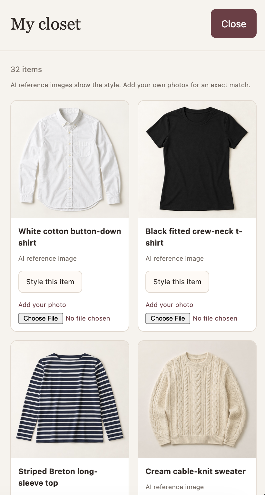

# Styled by Ankita & Arshnoor

Have a closet full of clothes but still feel like you have nothing to wear? Styled helps you put outfits together with what you already own. You can start with a favorite piece, dress for the weather, explore Pinterest inspiration, or look for something new to complete a look.

Styled is for anyone and everyone who feels like they are constantly shopping, forgetting about pieces they own, and wearing the same outfits. Styled aims to help you love what you already own and build a wardrobe that you're excited about. Style inspiration, outfit suggestions, and finding new items are just the beginning. Below each of the key features are detailed with some examples.

## Start with a question

Open the app and type in the chat, or choose one of the example buttons in the starting panel. The buttons fill in a question for you—you can change it before pressing **Send**.

You can be as specific as you like. Mention an occasion, a color, your city, or a budget if it matters. Then keep the conversation going: “Make it more relaxed,” “Use flat shoes instead,” or “Give me another option with the same shirt.”

## Pick something from your closet

Click **My closet** in the top-right corner to open a scrollable sidebar with your clothing, shoes, and accessories. This version starts with a shared demo wardrobe, so the items you see are examples rather than a separate personal closet for each visitor.

Find something you want to wear and click **Style this item**. The sidebar closes and adds a message like this to the text bar:

> Help me style this item: White cotton button-down shirt.

Press **Send**, and the stylist will look for pieces to go with it. You can start with shoes or accessories too—it will build the outfit around whichever item you chose.

For outfit suggestions, you’ll see a short description and a visual arrangement for each look. The top appears first, followed by the bottoms and then the shoes. A dress can take the place of a top and bottoms. Only the pieces selected for that outfit appear in its arrangement.

For example, an outfit built around the white shirt might show:

- White cotton button-down shirt
- High-rise straight-leg jeans
- White leather sneakers

If the stylist suggests another outfit, it gets its own arrangement so you can compare the looks.

## Wear more of what you own

Try **One piece, three ways** when you want to get more use out of a favorite item. The stylist searches your closet, puts together different combinations, and displays the selected pieces for each outfit. It uses the wardrobe descriptions to help plan; you can still tell it if a pairing isn’t your style.

Before buying something, try **Do I need another one?** For example:

> I’m thinking of buying another black blazer. Check whether I already own something similar before I shop.

The stylist compares the proposed item’s category, color and description with your closet and explains any possible overlap. It can help you notice a repeat purchase, while leaving the final decision to you.

## Add an item or a photo

Use **Add a new item** to start adding something to the wardrobe. The stylist can ask for details, or you can give them up front:

> Add a burgundy cardigan to my closet. It’s a top for fall and winter, with work and layering tags.

Reopen **My closet** to see the new item. Choose **Add your photo** on its card to attach a picture of that garment. Closet photos are saved with the item and used in future outfit displays. The existing images labeled **AI reference image** are generated examples of the clothing, not photos of the actual garments.

The **Attach a photo** control below the chat has a different purpose: use it to share an inspiration photo and ask for similar products. For example:

> Find products online similar to the jacket in my attached photo, under 100 USD per item.

You’ll see a preview before sending. Both photo controls accept JPEG, PNG, and WebP files up to 5 MB. A clear photo of one garment usually makes it easier to find a similar style. Photo searches look for similar pieces; they don’t guarantee the exact brand or item.

## A few questions to try

| Ask this | What to expect |
| --- | --- |
| “Put together a work outfit using items from my closet.” | Outfit ideas using the saved wardrobe, with the selected pieces pictured together. |
| “Give me three ways to style my black ankle boots.” | Different outfits built around the same boots. |
| “What should I wear from my closet for the current weather in New York?” | Suggestions that take the city’s current weather into account. |
| “Find brown jackets under 100 USD per item.” | Product cards with images, listed prices, retailers, and **View item** links. |
| “Find Pinterest inspiration for styling black boots for fall.” | Inspiration images with **View pin** links to Pinterest. |
| “Help me dress for a cartoon-character-themed party. Check my closet first, then find anything I’m missing online.” | A character-inspired outfit using existing pieces, with shopping suggestions if needed. |
| “What colors and types of clothing do I have most of?” | A summary of what’s in the wardrobe. |

Shopping budgets are in USD per item. Check the linked listing for current prices, sizes, availability, shipping, and tax. Some links open Google Shopping before the retailer’s page.

Pinterest results come from public pins, so there’s no need to connect an account. If you like a particular image, upload it in the chat or describe what you like about it to help the stylist work from that look.

## See how a suggestion was made

The expandable **Tool call** rows show when the stylist checks your closet, looks up the weather, searches for products or pins, or selects pieces for an outfit. Click a row to see the full tool name, arguments, and result. This lets you see what information the stylist used.

These traces are intentionally available for the project demonstration. You don’t need to type tool names or understand the raw output—just ask a question normally and read the answer and outfit cards below.

## Your conversation

Follow-up questions stay in the same conversation while the tab is open. **New chat** starts fresh. Recent text turns travel with your next message as a fallback if the server instance changes. Refreshing the page starts a fresh browser conversation; earlier uploaded photos are not included in that text fallback.

This is a shared demo wardrobe. Additions and uploaded closet photos are saved on the running server instance, so they can reset when the hosted app restarts or moves to another instance.

## Tool Overview

The app has seven tools. `get_weather`, `search_products`, and `search_pinterest_pins` request external data. `search_closet`, `add_closet_item`, and `get_closet_stats` read or update the demo wardrobe. `present_outfits` turns selected item IDs into the displayed outfit arrangements.

>**Tools**
>1. `get_weather` is the tool that was presented during class that gets current temperature for a given city. Styled leverages this to suggest weather-related outfit modifications.
>
>2. `search_products` uses SearchApi.io to look through Google Shopping. It searches for US Clothing listings, prices, retailers, images, and links. It mostly finds similar styles, not exact matches.
>
>3. `search_pinterest_pins` leverages Google Images to find public Pinterest outfit inspiration. Pin links and images are returned.
>
>4. `search_closet` looks through the user's own wardrobe and filters appropriately based on the provided details and occasion like category, color, season, tag, and name. Returns item IDs and images.
>
>5. `get_closet_stats` briefly summarizes what is in the user's closet. Helps users identify what items they have and what is missing.
>
>6. `add_closet_item` adds new items to the closet. Details like name, category, seasons, and tags can be provided, and photos can be uploaded later via "My closet."
>
>7. `present_outfits` displays outfit ideas generated by the model as visual cards. Each outfit includes photos for the required closet items.

Outfit planning uses `search_closet` to find owned pieces, the model to choose combinations, and `present_outfits` to display them.

For questions about buying something similar to an owned item, the model can use `search_closet` and compare the returned pieces with the proposed purchase. It chooses which tools to use based on the request.

### Tool Details and Memory
The model chooses tools and explains the results; the Python functions do the data lookup and rule-based comparisons. The `/chat` response retains `response`, `session_id`, and `tool_calls`, with each call’s `name`, `args`, and `result`. Tool calls remain inspectable in the interface.

To explore conversation memory, ask for a look with flat shoes and then say “Make it suitable for work, but keep my shoe preference.” Use **New chat** before trying a different person’s preferences.
